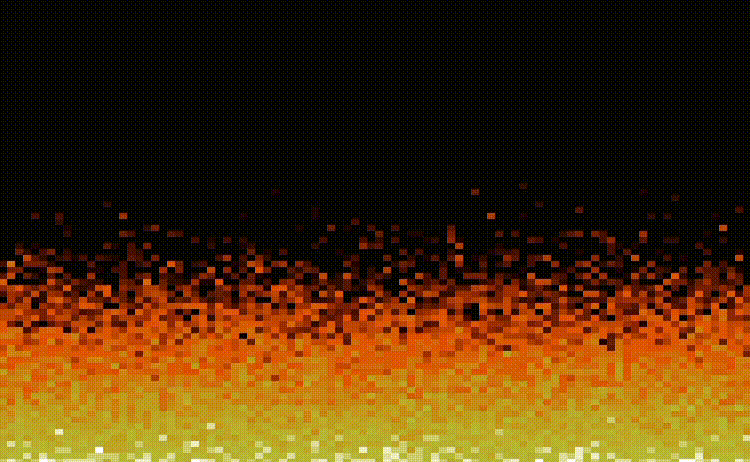
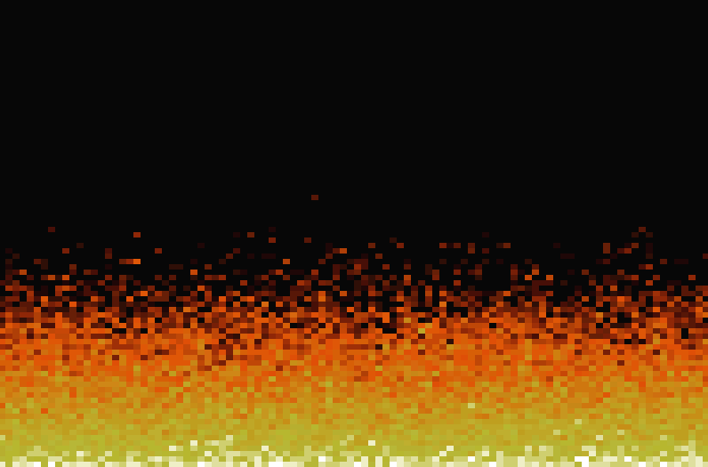

<div align="center">
  
  
  <a href="https://git.io/typing-svg">
    
  </a>
</div>

<div align="center">
  
  <br>
  <sub><i>O clássico efeito de fogo do DOOM (1993), recriado matematicamente com Python.</i></sub>
</div>

<br>

<div align="center">

[](https://python.org)
[](https://numpy.org)
[](https://jupyter.org)
[](https://fabiensanglard.net/doom_fire_psx/)

</div>

---

## 🔥 Sobre o Projeto

O **Jupyter Doom Fire Engine** é um estudo de caso sobre como transformar algoritmos clássicos de renderização procedural em operações matemáticas vetorizadas modernas.

Originalmente, o efeito de fogo do jogo Doom (PSX) foi escrito em Assembly/C para otimizar cada ciclo de clock da CPU. A lógica consistia em iterar sobre cada pixel da tela, calcular seu calor e espalhá-lo para cima.

**O Desafio:** Em Python puro, loops aninhados (`for x in width: for y in height`) são extremamente lentos para renderização em tempo real.

**A Solução:** Utilizei a biblioteca **NumPy** para tratar a tela inteira não como pixels individuais, mas como uma **Matriz (Raster)**. Isso nos permite aplicar as leis da física do fogo em milhares de pixels simultaneamente através de operações de álgebra linear e *slicing*.

---

## A Engenharia por Trás do Código

O código não desenha fogo; ele simula a propagação de calor em uma grade.

### 1. O Conceito de "Space-Time Cube"
Diferente de um jogo que roda em "tempo real" (calculando o frame atual baseado no anterior instantaneamente), esta implementação gera um **Cubo de Dados 3D** pré-calculado:

$$Cubo_{Dados} = (Tempo \times Altura \times Largura)$$

Isso cria um tensor tridimensional onde cada "fatia" é um quadro da animação.

### 2. A Matemática da Propagação (Vectorization)
Ao invés de processar pixel por pixel, usamos **Slicing de Arrays** para propagar o calor. A lógica física é:
> *"O calor de um pixel é igual ao calor do pixel abaixo dele, menos um pouco de resfriamento aleatório."*

No código, isso é feito sem loops espaciais (apenas temporais):

```python
# Slicing Numpy:
# frame_anterior[1:, :]  -> Pega todas as linhas, exceto a primeira (pixels "de baixo")
# frame_anterior[:-1, :] -> Pega todas as linhas, exceto a última (pixels "de cima")

calor_propagado = np.maximum(0, frame_anterior[1:, :] - decay_tensor[t, 1:, :])

```

### 3. Simulação de Vento e Turbulência

Para dar o efeito orgânico do fogo, o calor não sobe apenas em linha reta; ele sofre deslocamento lateral (vento).
Utilizamos `np.roll` para deslocar os valores da matriz circularmente, simulando a turbulência do ar quente.

---

## 🛠️ Explicação das Bibliotecas

| Biblioteca | Função no Projeto |
|-----------|------------------|
| **NumPy** <br> | Motor principal de cálculo vetorial. Substitui loops Python por operações C altamente otimizadas. |
| **Pillow (PIL)** <br> | Conversão de arrays RGB em imagens PNG. |
| **IPyWidgets** <br> | Player interativo e controle da animação diretamente no navegador. |
| **Jupyter / VS Code** <br> | Ambiente de desenvolvimento e execução interativa. |

## 🎨 A Paleta de Cores (Map Color)

O algoritmo original não trabalha com cores RGB, mas sim com **Índices de Calor** (0 a 36).

* **36:** Branco (Fogo mais quente/Base)
* **Incandescente:** Amarelo -> Laranja -> Vermelho
* **0:** Preto (Frio/Fundo)

<div align="center">



<sub><i>Representação visual dos valores da matriz sendo mapeados para cores.</i></sub>
</div>

---

## 🚀 Como Executar

Este projeto foi desenhado para rodar dentro de um **Jupyter Notebook**.

1. **Clone o repositório:**
```bash
git clone [https://github.com/PedroLuizskt/Jupyter_doom_fire_engine.git](https://github.com/PedroLuizskt/Jupyter_doom_fire_engine.git)

```


2. **Instale as dependências:**
```bash
pip install numpy ipywidgets pillow

```


3. **Abra o arquivo:**
Execute o arquivo `doom_fogo.ipynb` no seu VSCode ou Jupyter Lab.
4. **Resultado:**
O script irá gerar o cubo de dados e exibir um widget interativo. Clique em "Replay" para ver o fogo queimar!

---

<div align="center">
  
<sub>Desenvolvido com 🔥 por <a href="https://github.com/PedroLuizskt">Pedro Luiz</a></sub>

</div>

```
